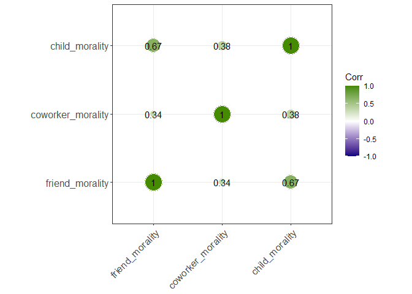
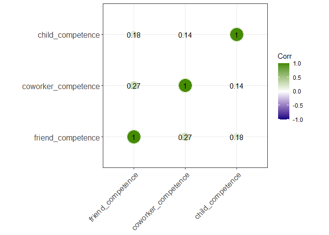

Portfolio 11 – Recreating a Bar Plot
================
Ryan Wheat
05/07/2023

## Background

I’m going to continue my work from my previous portfolio. That is, I’m
going to see whether participants select competence over moral traits
more for coworkers than for others.

### To What Degree Are Moral Traits Chosen Over Competence and Sociability Traits for Friends, Coworkers, and Children?

``` r
#wide to long 

mc_anova_data <- main_data %>%
  select(1, 14, 16, 18) %>%
  filter(!is.na(child_moral_v_comp) & !is.na(coworker_moral_v_comp) & !is.na(friend_moral_v_comp)) %>%
  pivot_longer(!ID, names_to = "Target", values_to = "Moral_Choices")

#run ANOVA

target_competence <- aov(Moral_Choices ~ Target + Error(ID), data = mc_anova_data)

summary(target_competence)
```

    ## 
    ## Error: ID
    ##           Df Sum Sq Mean Sq F value Pr(>F)
    ## Residuals 88  126.4   1.436               
    ## 
    ## Error: Within
    ##            Df Sum Sq Mean Sq F value Pr(>F)    
    ## Target      2 233.43   116.7   231.6 <2e-16 ***
    ## Residuals 188  94.74     0.5                   
    ## ---
    ## Signif. codes:  0 '***' 0.001 '**' 0.01 '*' 0.05 '.' 0.1 ' ' 1

It seems that there is a difference between the ideal friends,
coworkers, and children in the extent to which people prefer them to
have moral trait over competence traits. Lets see if this is also true
for moral vs. sociable traits.

``` r
#wide to long

ms_anova_data <- main_data %>%
  select(1, 15, 17, 19) %>%
  filter(!is.na(child_moral_v_soc) & !is.na(coworker_moral_v_soc) & !is.na(friend_moral_v_soc)) %>%
  pivot_longer(!ID, names_to = "Target", values_to = "Moral_Choices")

#run ANOVA

target_sociab <- aov(Moral_Choices ~ Target + Error(ID), data = ms_anova_data)

summary(target_sociab)
```

    ## 
    ## Error: ID
    ##           Df Sum Sq Mean Sq F value Pr(>F)
    ## Residuals 88  164.3   1.868               
    ## 
    ## Error: Within
    ##            Df Sum Sq Mean Sq F value  Pr(>F)   
    ## Target      2   7.68    3.84   6.619 0.00166 **
    ## Residuals 191 110.82    0.58                   
    ## ---
    ## Signif. codes:  0 '***' 0.001 '**' 0.01 '*' 0.05 '.' 0.1 ' ' 1

Interesting. I wasn’t necessarily expecting people to pick moral traits
over sociable traits to a different extent for the ideal friend,
coworker, or child. If people are choosing sociable traits over moral
traits more frequently for coworkers than children/friends, that could
also explain the results I found in Portfolio 9.

### Post-Hoc Tests

Let’s run some follow up tests to see what might be going on here.
First, I’ll compare the number of times someone picked a moral trait
over a competence trait for coworkers vs. friends, and coworkers
vs. children. I’ll do the same with moral vs. sociability traits in
order to see which of these – or if both – are responsible for previous
findings.

#### Comparing Coworkers to Friends and Children

``` r
#choosing coworker v child in the data

comparison1_data <- mc_anova_data %>%
  filter(Target != "friend_moral_v_comp")

#running test

coworker_v_child_c <- t.test(Moral_Choices ~ Target,
                      alternative = "two.sided",
                      paired = TRUE,
                      data = comparison1_data)

coworker_v_child_c
```

    ## 
    ##  Paired t-test
    ## 
    ## data:  Moral_Choices by Target
    ## t = 14.691, df = 92, p-value < 2.2e-16
    ## alternative hypothesis: true mean difference is not equal to 0
    ## 95 percent confidence interval:
    ##  1.422757 1.867566
    ## sample estimates:
    ## mean difference 
    ##        1.645161

``` r
#mean check

comparison1_data %>%
  group_by(Target) %>%
  summarise(mean(Moral_Choices))
```

    ## # A tibble: 2 × 2
    ##   Target                `mean(Moral_Choices)`
    ##   <chr>                                 <dbl>
    ## 1 child_moral_v_comp                     2.82
    ## 2 coworker_moral_v_comp                  1.17

``` r
#choosing coworker_v_friend in the dataframe

comparison2_data <- mc_anova_data %>%
  filter(Target != "child_moral_v_comp")

#running test

coworker_v_friend_c <- t.test(Moral_Choices ~ Target,
                      alternative = "two.sided",
                      paired = TRUE,
                      data = comparison2_data)

coworker_v_friend_c
```

    ## 
    ##  Paired t-test
    ## 
    ## data:  Moral_Choices by Target
    ## t = -20.959, df = 92, p-value < 2.2e-16
    ## alternative hypothesis: true mean difference is not equal to 0
    ## 95 percent confidence interval:
    ##  -2.342555 -1.937015
    ## sample estimates:
    ## mean difference 
    ##       -2.139785

``` r
#mean check

comparison2_data %>%
  group_by(Target) %>%
  summarise(mean(Moral_Choices))
```

    ## # A tibble: 2 × 2
    ##   Target                `mean(Moral_Choices)`
    ##   <chr>                                 <dbl>
    ## 1 coworker_moral_v_comp                  1.17
    ## 2 friend_moral_v_comp                    3.31

As expected, it seems that people chose competence traits over moral
ones ***more often*** for coworkers than children, t(92) = 14.69, p \<
.001, and than friends, t(92) = -20.96, p \< .001. Let’s see if this is
also the case for sociable traits.

``` r
#choosing coworker v child in the data

comparison3_data <- ms_anova_data %>%
  filter(Target != "friend_moral_v_soc")

#running test

coworker_v_child_s <- t.test(Moral_Choices ~ Target,
                      alternative = "two.sided",
                      paired = TRUE,
                      data = comparison3_data)

coworker_v_child_s
```

    ## 
    ##  Paired t-test
    ## 
    ## data:  Moral_Choices by Target
    ## t = -1.0446, df = 93, p-value = 0.2989
    ## alternative hypothesis: true mean difference is not equal to 0
    ## 95 percent confidence interval:
    ##  -0.3394849  0.1054424
    ## sample estimates:
    ## mean difference 
    ##      -0.1170213

``` r
#mean check

comparison3_data %>%
  group_by(Target) %>%
  summarise(mean(Moral_Choices))
```

    ## # A tibble: 2 × 2
    ##   Target               `mean(Moral_Choices)`
    ##   <chr>                                <dbl>
    ## 1 child_moral_v_soc                     2.99
    ## 2 coworker_moral_v_soc                  3.11

``` r
#choosing coworker_v_friend in the dataframe

comparison4_data <- ms_anova_data %>%
  filter(Target != "child_moral_v_soc")

#running test

coworker_v_friend_s <- t.test(Moral_Choices ~ Target,
                      alternative = "two.sided",
                      paired = TRUE,
                      data = comparison4_data)

coworker_v_friend_s
```

    ## 
    ##  Paired t-test
    ## 
    ## data:  Moral_Choices by Target
    ## t = 3.1741, df = 93, p-value = 0.002038
    ## alternative hypothesis: true mean difference is not equal to 0
    ## 95 percent confidence interval:
    ##  0.147360 0.639874
    ## sample estimates:
    ## mean difference 
    ##        0.393617

``` r
#mean check

comparison4_data %>%
  group_by(Target) %>%
  summarise(mean(Moral_Choices))
```

    ## # A tibble: 2 × 2
    ##   Target               `mean(Moral_Choices)`
    ##   <chr>                                <dbl>
    ## 1 coworker_moral_v_soc                  3.11
    ## 2 friend_moral_v_soc                    2.71

Participants chose sociable traits over moral traits ***less*** often
for coworkers than they did for friends, t(93) = 3.17, p = .002. And
there was ***no difference*** in the frequency with which participants
selected moral traits over sociable traits for their ideal child and
ideal coworker, t(93) = -1.04, p = .30. These findings go against the
idea that sociability trait selections are what is driving the
difference in moral trait preferences for coworkers
vs. children/friends.

Broadly speaking, these results explain findings from my past portfolio
showing that people generally preferred moral traits more in friends and
children than they did in coworkers. That is, this effect is due to
people choosing competence traits over moral traits more often for their
ideal coworker than for their ideal friend or child – and NOT because
they are choosing sociable traits over moral traits more often for
coworkers.

I was going to do more on this topic, but I actually think these results
answer this question pretty soundly. Let’s move on to a different
question.

### Are There Individual Differences in the Extent to Which Participants Preferred Certain Traits in their Ideal Targets?

To answer this question, I am going to run some correlations to see
whether people who preferred moral traits, competence traits, and
sociability traits for some targets tended to prefer them for other
targets.

I would like to run latent profile analysis to see whether there are
profiles of responses that go together, but I don’t know how to do that
and don’t have time to learn. So correlations will have to do.

``` r
#morality traits

moral_corr <- cor(main_data[2:4],
    use = "complete.obs")

#competence traits

competence_corr <- cor(main_data[5:7],
    use = "complete.obs")

#sociability traits

sociability_corr <- cor(main_data[8:10],
    use = "complete.obs")

#all together

alltraits_corr <- cor(main_data[2:10],
                      us = "complete.obs")

#plot

ggcorrplot(alltraits_corr,
           method = "circle",
           type = "lower",
           lab= TRUE,
           insig = "blank",
           colors = c("navyblue", "white", "maroon"),
           outline.color = "white",
           ggtheme = ggplot2::theme_bw)
```

<!-- -->

``` r
ggcorrplot(moral_corr,
           method = "circle",
           type = "lower",
           lab = TRUE,
           insig = "blank",
           colors = c("navyblue", "white", "maroon"),
           outline.color = "white",
           ggtheme = ggplot2::theme_bw)
```

<!-- -->

It seems like everything is correlated with everything.
